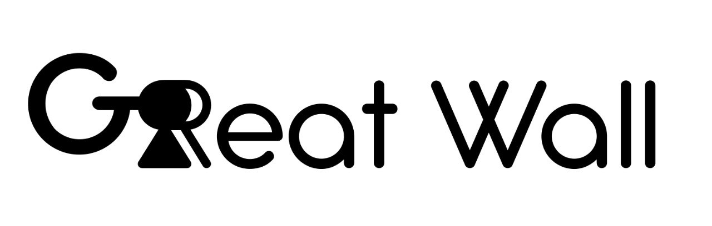

<!-- PROJECT LOGO -->
<p align="center">
  <a href="https://github.com/Yuri-SVB/Great_Wall">
	
  </a>
  <h3 align="center">Great Wall</h3>
  <p align="center">Protocol and application for providing Kerckhoffian, 0-trust, deviceless coercion-resistance in self-custody. For details, see <a href="docs/index.md">docs</a>. To understand the protocol, refer to the <a href="white_paper_executive_summary/executive_summary.md">executive summary</a>.
  </p>
   
  <p align="center">
    <a href="../LICENSE"></a>
    <a href="docs/"></a>
    <a href="https://www.python.org/"></a>
    <a href=""></a>
  </p>
</p>


<!-- TABLE OF CONTENTS -->
## Table of Contents
1. [About](#about)
2. [Demo]()
3. [Getting Started](#getting-started)
    * [Dependencies](#dependencies)
    * [Installation](#installation)
4. [Usage](#usage)
5. [Background]()
6. [Pitches](#pitches)
7. [Business Related](#pitches)
8. [License](#license)
9. [Contact](#contact)


<!-- About -->
## About
Protocol and application for providing Kerckhoffian, 0-trust, deviceless coercion-resistance in self-custody. To understand the protocol, refer to the [executive summary.](./white_paper_executive_summary/executive_summary.md)

<!-- Getting Started -->
## Getting Started
This section will provide you by a quick guide to start.

### Dependencies
This project depends on the following packages:
1. argon2-cffi = 23.1.0
2. argon2-cffi-bindings = 21.2.0
3. cffi = 1.16.0
4. numpy = 1.25.0
5. Pillow = 10.1.0
6. pycparser = 2.21
7. PyQt5 = 5.15.10
8. PyQt5-Qt5 = 5.15.2
9. PyQt5-sip = 12.13.0

### Installation
Follow the following to get your environment ready:
1. Install system package requirements:
```sh
sudo apt install python3-setuptools python3-virtualenv qtbase5-dev qt5-qmake cmake
```
2. Set up a python virtual environment and activate it:
```sh
python3 -m venv .venv
source .venv/bin/activate
```
3. Install the requirements:
```sh
pip install -r requirements.txt
```
4. Now, you can run the app using the following:

```sh
cd Great_Wall/src/greatwall/
python3 gui.py
```
> **_NOTE:_** The previously described method to run app is not the recommend
one, but as we still in the development cycle this is the simplest way
to get things ready :).

### Using in Beta
Coming soon. An advanced, knowledgeable, tech-savvy reader, will, at this point, have understood what is to come and can improvise the steps by themselves. In a nutshell, all you have to do is to securely manage[^1] a brute-force resistant `SA0`, true-randomly generate a path vector of `L_i`'s, and memorize them procedurally as explained in the session above. For better effect, user can implement non-trivial **T**ime-**L**ock **P**uzzle, to impose desired time on derivation of `SA3` from `SA0`. To prevent leakage of critical content through Anki, a simple scheme with salt and pepper can be done so to avoid the need to modify Anki, but we'll leave this for a next time.

[^1]: That is, either memorize it, or deterministically derive it from other brute-force resistant secret information, or symmetrically encrypt it with a master key falling back in one of 2 previous cases and manage well the encrypted database.
