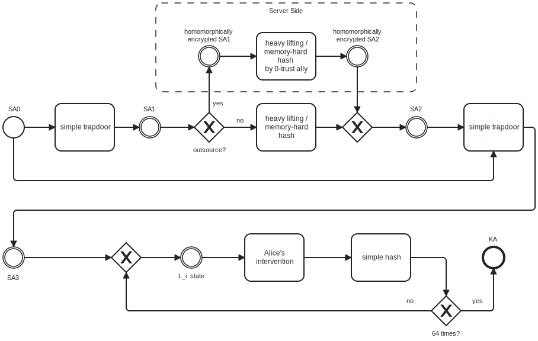

# Great Wall white paper / executive summary

The wake of the last crypto winter has the vivid memory of recent events that were both long anticipated by the founding doctrine of Bitcoin, and pointed out as unmistakable confirmation of it. In one hand, we have the exponential inflation of the supplies of essentially all state currencies simultaneously as consequence of abuse of them by state power, including, particularly the mighty US Dollar. On the other hand a case like FTX collapse is an eery reminder of the aphorism "not your keys, not your coins". More than ever, therefore, early adopters and newcomers alike are feeling the necessity to *afford and/or improve self-custody* of their crypto patrimony. Is, however, the community ready for it?

## Obscurity: a Rapidly Eroding Wall that Urgently Needs Replacement

In technical jargon, we call *obscurity* the secrecy of a given security method. Another term often employed and worth registering is the *5-dollars wrench attack*. The latter, [consecrated by a viral XKCD comic](https://xkcd.com/538/), refers to use of violence or threat thereof to extract secret information from a victim against their free consent or interest.

As of the moment for writing, the *still* relatively small *(but ever more rapidly growing)* community of Bitcoin holders benefits from at least three passive layers of defense based on obscurity:

1. **Obscurity per se**: In order to threaten a victim into giving away Bitcoin, a coercing adversary has to, first, know the bare minimum to understand how to keep, transfer, spend it, or, in one word, operate it in any meaningful way. Most such individuals (ordinary thieves) are *still* not sophisticated enough to have learned that, among other reasons, because the pool of potential victims does not *yet* justify the learning curve in many cases; That leads us to...
2. **Anonymity**: Even the robbers that do know the bare minimum about Bitcoin to be able to obtain it through robbery and proceed to extract value from the stolen property, still have the problem of first having to locate a potential victim before conducting the coercion. Bitcoin users *still* are a minority that blends in the *still* much larger crowd of non-users;
3. **Plausible Deniability**: Even if a given robber does learn the bare minimum about Bitcoin, **and** does manage to land on a potential victim, there is *still* a considerable probability that at least one of the following claims are credible enough to dissuade the robbery:
    - **Denial of existence of Bitcoin patrimony**, as in:
      *I actually don't have such a thing as Bitcoin;* or *I did have it but, at some point, I decided to sell / lost the little I had.*;
    - **Denial of Easy Access**', as in:
      *I do have Bitcoin, but, in order to access it, we would have to first go to that difficult-to-get-address where a certain hardware containing a secret key is located, and / or have to authenticate myself to trusted third parties and prove beyond reasonable doubt I'm not under coercion* --- When that is actually false;
Finally, there is the following non-passive defense which is, nevertheless obscure:
5. **Obscurely Cancellable Transaction**: Consists of having a transaction be time-locked, and, before maturity, possible to be reversed. Victim pretends to cooperate with adversary, and, upon release from adversary's custody enacts abortion of transaction done under coercion.

Every case from items 1 to 3 above is but circumstantially true, due only to either insufficient spread of adoption of Bitcoin or insufficient diffusion of knowledge about Bitcoin itself or about techniques and practices to secure it or ignorance by the adversary about the methods in use. Said shortly:

> *All the passive lines of defense cited above are consequence of obscurity and, as such, violate Kerckhoff's principle and grow weaker with the inevitable diffusion of knowledge.*

In addition to simply being rendered ineffective by knowledge diffusion the following are possible catastrophic unattended consequences of specific defenses:

3. a: Aware of the existence of [steganographic techniques](https://en.wikipedia.org/wiki/Steganography), a distrusting adversary might continue to indefinitely and fruitlessly brutalize their victim after the latter have already cooperated with the former in all possible ways, motivated by the suspicion that victim has still more. Side note: notice that this undesirable consequence is true even for individuals who, for whatever reason, have no Bitcoin at all;
4. Aware of the existence of that technique, adversary may decide to assassinate victim as a viable strategy to prevent them from undoing the robbery transaction;

The attentive reader may, at this point, pose the argument that *actually deploying* the active defenses described in item 3.b, instead of falsely claiming it, would be a valid solution. *To an extent* they would be right. Information security solutions, however, are all about trade-offs. The following are downsides of approaches 3.b:

* **High Cost**: Having a system to evaluate occurrence of coercion with [high sensitivity (and preferably high specificity)](https://en.wikipedia.org/wiki/Sensitivity_and_specificity) will necessarily require human labor by a **T**rusted **T**hird **P**arty --- more about that soon. Distribution of physical key or keys in one or more remote addresses assumes custodian has the means to afford *secure physical storage* in one or more addresses and the addresses themselves in the first place. It can be argued that latter's cost can be minimized by outsourcing the ownership of such physical addresses, but that leads us to...
* **Shared Custody**: Depending on a TTP to either check you for coercion and deny you access to your funds if coercion is detected or suspected or to own physical addresses where physical keys are distributed kills, or, at the very least seriously weakens the premise of **self-custody**. We should also mention...
* **Questionable Efficacy**: What are the premises that such ceremony for negative proof of coercion has to have to render it mostly effective? Namely: the adversary can always contemplate threatening to kill or brutalize victim to convince TTP to cooperate. What conditions are really sufficient to preclude that? Will those conditions not fall back to two previous problems? In the case of physical distribution of keys: How far apart the remote locations of physical keys have to be from each other to make it unfeasible for a coerced owner visit one by one at gun point during a flash kidnap? Finally, there is the problem of...
* **Downsides of PBA**: Comparing **K**nowlege-**B**ased **A**uthentication with **P**ossession-**B**ased **A**uthentication becomes easy by starting from the following truism:

    > *One's brain is one's most available and closely guarded hardware.*

Securely physically distributing keys obviously imposes the cost of reliably monitoring its physical security remotely. Then there are the costs associating to setting up, resetting and updating that physical infrastructure ie.: consider the implications of traveling or relocating for such scheme. With that scheme, user makes his property less available to themself depending on their location. Finally, threatening to destroy or render unavailable an external device that is critical for the completion of a protocol, can be used as a negotiation leverage by an adversary to coerce victim into doing *favors of various sorts* or formal transfer of properties that require intensive intervention, like real state. If the only critical 'device' is victim's own brain, and if the latter has an inheritance protocol in place --- more about that later --- the Bitcoin patrimony itself is no longer a surface of coercive attack.

## Monetizable, Deviceless, Non-Obscure, Coercion-Resistant Self-Custody --- To Have a Pie and Eat It Too (Several Times Over)

The following lemmas are consequences of the premises covered so far:

1. The so desired bonuses **self-custody**, as stated by the founding Bitcoin doctrine, come at the cost of certain **onuses**, among which, attainment of **resistance to coercion**;
2. The (relatively) early stage of adoption of Bitcoin and related information security techniques and practices provides the community of (relatively) early adopters with **layers defense against coercion** that are inherently **obscure**;
3. As a consequence of insufficiency and inadequacy of non-obscure methods, community tends to overuse --- *and misuse* --- obscure ones. Not mentioned above, but the severe problem of loss of Bitcoin is, to a great extent, caused by amateur obscure key management, as in *User hides wallets and keys 'so well' that ends up hiding them from themself*;
4. As a direct consequence of **Kerckhoff's Principle**, that is, from **inevitability of diffusion of knowledge**, it is safe to assume the aforementioned **obscure layers of coercion-resistance** will rapidly become **ineffective**;
5. As a consequence, the **costs and downsides** associated to the few currently available non-obscure approaches to coercion-resistance **will aggravate**. From the point of view of Design and Verification of Security Protocols, it translates to **repressed demand for more efficient, non-obscure solutions for coercion-resistance in self-custody**.

At this point, the clever reader would be right to have grown greatly intrigued and skeptical about what is to come. After all, it can also be said that there is a hugely repressed demand for [cornucopias](https://en.wikipedia.org/wiki/Cornucopia), [philosopher's stones](https://en.wikipedia.org/wiki/Philosopher's_stone) and [time-machines](https://en.wikipedia.org/wiki/Time_travel). Our critical analysis of the problem of coercion-resistance yields the following ambitious wish-list of information security properties for our protocol:

1. **Self-Custody** --- It's the basic premise of Bitcoin: The owner, and the owner alone is able to perform the protocol of access to their funds;
2. **Non-Obscurity** --- Another way to enunciate the **Kerckhoff's Principle**, or *The adversary perfectly understands the protocol, and it works nevertheless.* In fact, if anything, protocol *benefits* from adversary knowing it: a knowledgeable adversay is prone to giving up commitment of coercion, while an ignorant one may start it before being convinced of its futility. For that, the characteristic of a protocol of becoming **more effective** when understood by adversaries, we propose the term **Anti-Obscurity**;
3. **Devicelessness** --- Loss, destruction, geographic separation, theft or threat to any (external) device doesn't interfere with such Kerckhoffian (that is, transparent) protocol that the owner and the owner alone can perform;
4. **Monetization** --- Since this is an executive summary for a startup, we want that this transparent protocol that the owner and the owner alone can perform without any external critical device can somehow be *optionally aided by a 0-trusted ally* whom the owner then hires for that purpose;
5. **Coercion-Resistance** --- Then, we want that this KBA-only, trustless but possible-to-be-aided-by-third-parties protocol to be *non-transferable even to an adversary that has the owner's full cooperation through coercion*, even if said adversary understands the said protocol perfectly;
6. **No Unintended Negative Incentives** --- Last but not least, on top of all properties above, protocol has to give adversary no material incentive to assassinate victim as a way to commit the stealing itself. And being KBA-only, the protocol provides no critical device adversary can remotely (therefore more easily) threaten to destroy as a leverage to coerce victim into doing lengthier processes of formal property transfer. All in all, we present a...

> *Kerckhoffian, KBA-only, trustless, monetizable access protocol not transferable even to a complete-knowledge coercive adversary, and that does not, in any possible state, offer to adversaries a rational strategic advantage to assassination, harm or threat of the user.*

Without further ado, let's dive into this protocol:

## TKBA --- The Logical Property to Seek:

Our proposed protocol has two main components: the first stems from the premise also adopted by existing solutions (some even previously mentioned) that *imposing a requirement of time to the adversary's coercion reders it much harder and riskier for them.* To that end, we resort to the long consacrated and [ever evolving](https://eprint.iacr.org/2019/635.pdf) concept [firstly introduced by Rivest, Shamir and Wagner of **T**ime-**L**ock **P**uzzles](https://people.csail.mit.edu/rivest/pubs/RSW96.pdf).

The second main component is **T**acit **K**nowlege-**B**ased **A**uthentication. As the name indicates, it's a scheme to encode an *authenticating* piece of information that end user is able to memorize (aka *know*) but is nevertheless unable to express (hence *[tacit](https://en.wikipedia.org/wiki/Tacit_knowledge)*). There are abundant ways to achieve that and the recent surge of development of AI-based image synthesis definitely makes the claim even easier: any comparative nuances in images or sounds that are evident enough to perceive and memorize but subtle enough to accurately describe in words would work as *Tacit Authenticating Knowledge*.

Much like Bitcoin itself Great Wall is an original recombination of preexisting concepts. Combining the cryptographic imposition of an arbitrary time delay with the **in**capacity to transmit an authenticating information, unless upon being prompted by specific interface that has brute-force resistant parameters, we have coercion-resistance. Rationale is the way adversary can access said tacit authenticating information is keeping victim under custody for the entire said time. By setting said time to a few hours, days or possibly weeks, defendant impairs attack. The diagram below explain the protocol in terms of its cryptographic elements:

1. User inputs brute-force resistant SA0 (a strong password) from their memory;
2. Ordinary and non-critical device hashes SA0 into SA1;
3. SA1 is inputed to TLP, yielding SA2 as output. Optionally that process is outsourced (possibly with fully homomorphic encryption) to 0-trustweb-service for scale-economy;
4. SA2 is concatenated with SA0 and the result is hashed into SA3;
5. SA3 is inputed to the following loop:
6. Use current state to deterministically synthesize palette of images / sounds that differs by tacitly learnable nuances;
7. Take user's choice of palette's item, map it into bits, append it into state;
8. Hash current state into next one;
9. If target number of iterations have been performed, terminate loop; else go back to step 6;
10. Deterministically derive KA from state.

## Monetization

The simplest monetization venue is given by the TLP and is given the following nuanced fact in which these puzzles are based:

> *Due to hard constraints directly consequence of physics (...), a disproportionately higher investment in hardware can but marginally improve performance in serial, memory-hard computation when compared to ordinary hardware.*

In other words, since it's asymptotically hard to increase **frequency** of electronics, the necessary **time** to perform a **serial** computation can only be **slightly diminished**, even then, only at a **great cost**. Conversely, a defendant agent willing to impose a time cost onto adversaries, even assuming a much stronger adversary, have to self impose a time cost only **slightly higher**.

As a consequence of the lemma above, *even considering worst case scenario, in order to impose a time requirement of 24 hours of coercion for a robbery to be successful, the owner imposes on themself a requirement of no more than a few days between deciding to access their funds and actually accessing them.* In other words, if **not** by this cleverly exploited paradigm, imposing T hours as requirement for an adversary would come at a cost of imposing an arbitrary number of ours to one's own access, where this number would be as higher as stronger the adversary is to the defendant.

Monetization happens as a means to deliver to the user the convenience of not having to conduct such memory-hard, serial, lengthy computation on their own ordinary device, as well as not having to wait as much. The vast majority of people, particularly low-income and / or from underdeveloped countries, and / or from countries afflicted by chronic hyperinflation and / or crime --- where our solution is most critically necessary --- have access to smartphones far earlier than to PC's (if at all they get access to PC's). Therefore, affording a few hours or even days of 1 core in a high-performing machine in the cloud, with access to cheap energy will in most cases be worth freeing their own ordinary device --- and anticipating the access to their funds --- for a proportional amount of time.

In summary:

> Through the use of TLP, user imposes hours, days or weeks of required time for a hardware-intensive adversary, therefore precluding most conceivable forms of coercion. By doing that, they impose on ordinary devices between 2 and 4 times that amount. To avoid that time overhead and to relieve their devices from that burden, users can outsource the solving of that TLP to ally with higher scale economy without compromise of custody or other security properties.

## Validation of Properties

1. **Self-Custody** --- Owner and the owner alone is perfectly able to perform the entire protocol by themself with an ordinary device;

   a. Having provider of HPC time-lock puzzle solver be absent only means less of convenience for solving time-lock puzzle;
   
   b. Because SA1 is a trapdoor function of SA0, TLP solver cannot obtain SA0;
   
   c. Because TLP solver can't obtain SA0 and SA3 is a hash of the concatenation of the latter with SA2, TLP solver cannot obtain SA3;
   
   d. Because owner hires TLP solver remotely and anonymously, TLP solver cannot collude with coercive adversary;
   
   e. Alternatively to the anonymity defense described in previous item, it could be possible to develop an homomorphic scheme that allows TLP solver to compute an encryption of SA2 without seeing SA2 proper, improving from anonymity to actual confidentiality;
   
2. **Non-Obscurity** --- Understanding how the protocol works doesn't change how tacit knowledge from second phase of protocol is. By design, owner is still impeded from transmitting it to adversary; who, ...
3. **Coercion-Resistance** --- ... unless able to keep their victim under coercion for the entire duration of the protocol, can, at most, obtain SA3 but not KA. Target number of loop iterations is set so that brute-force guessing derivation path is unfeasible;
4. **Devicelessness** --- All user has to keep is the **brain memory** of SA0 and Tacit Authenticating Knowledge;
5. **No Unintended Negative Incentives** --- By design, there is no critical external device the adversary can threaten to destroy. Killing victim at any point offers adversary no advantage;
6. **Monetization** --- Covered in previous section.

## Business and Practical Considerations

We aim at a **seed investment of 100K USD for 12.5% of the company**, therefore with implied **valuation of 800K USD**. Refer to [valuation spreadsheet](../business-related/business_valuation.ods) and [development cost estimation spreadsheet](../business-related/business_dev_cost_estimation.ods).

Below are further considerations worth mentioning:

1. **Recurrent Payment** --- The human-memory-centric aspect of the protocol, particularly of its tacit knowledge component makes it critical that users periodically rerun the protocol just to revisit their tacit memory to consolidate it over time, even if they do not intend to actually access the protected funds. From the point of view of business, this means **recurrent payment**.
2. **Combined use with other protocols** --- Great Wall is ultimately a key derivation scheme and, as such, does not interfere with and can be implemented on top of other protocols. The following two are examples of that:

   a. **Inheritance** --- Testator uses GW to derive keys that hold inheritance. They sign the on-chain transaction correspondent to the inheritance with a long time (possibly years) of time-lock. Periodically testator revokes current inheritance transaction and substitute it for a new one. Setup and updates should aim at trade-off compromising between risk of having heirs waiting too long for time-locked inheritance transaction, risk of having inheritance transaction accidentally happening before expected, cost and on-chain footprint associated to too many such updates. Heirs use GW to derive keys of heir addresses.

   b. **Shared-Custody** --- Each co-signer have their respective key(s) be derived by GW. That arrangement may be used to achieve:   
       i. **Redundance** --- In other words, to prevent loss funds due to failure of human memory;   
       ii. **Coercion-Resistance** --- An m out of n setup with m slightly above n/2 and owner custodiating approximately n/2 keys implies that no co-signer can alone make a transaction;   
       iii. **Inheritance** --- The same setup as in previous item can be made in such a way that the larger n/2 keys custodian is the testator and all the others are their heirs.
   
4. **Devices** --- Modifying the protocol to have it include devices that are critical for its execution would, as argued, undermine part of its properties, as previously explained, notedly:

   a. **No Leverage to Attackers** --- An adversary could use threat of destruction of critical devices as a way to coerce victim into enacting formal legal property transfers that require lenghty intervention like vehicles or real-estate;

   b. **Device Independence** --- Overall problems associated to PBA will then manifest, namely: risk of malfunctioning, loss or destruction of device. Availability and efficacy of protocol will, then, vary according to owner's geography in case device is separated from user;

Possible gains associating to sacrificing devicelessness of protocol include:

a. **More efficient TKBA interface** --- That is: to have a, therefore, critical device contain say a non-trivial user-specific AI training for image / sound deterministic synthesis;

b. **Avoid Forgetting** --- Have such device store SA0;

4. **Memory Formation** --- In order to reach the point of consolidated memory that only takes regular maintenacne, users need a slightly more intense practice. Anectdotal evidence from hardcore password-management users indicates that even lenthy passwords (around 50 digits) are essentially guaranteed to be remembered for months, after a short period of daily successful memory recollections. A human-memory-centric protocol like GW, naturally asks for calls for a (general purpose) feature like a **Memorization Assistant**, as well as more advanced mnemonic formats like **Formosa** --- see references.

5. **Lower-Hanging Fruits** --- Business analysis indicates that, as it usually is the case in a general context, though the lower-tier market (chronic inflation- and violence-afflicted third world populations) is much larger the higher-tier market (Bitcoin 'whales' and custodians of otherwise valuable corporate secrets) is more profitable, so should be prioritized by the first-movers. Speaking of which...

6. **First-Mover Advantage** --- Newcoming users gain from adhering to the provider with largest consumer base because blending in a larger consumer base means higher anonymity. This translates to defense against business-replication through network-lock-in. In other words, likewise with social networks, the first given player to consolidate dominance in the market tends to keep it due to network effect. There a few ways to enhance that effect, but those will be left outside of the scope of this document for strategic reasons.

## References

References including repercussion of this and adjacent projects in social media can be found in the links below:

[Demo](https://mega.nz/file/vfwhRTwZ#sP3hSRthQNssWRdcmD8XRNIeJX7Eq174ImY4eva_Pwo)

[Official Linktree](https://linktr.ee/greatwallt3)

[Formosa's Linktree](https://linktr.ee/formosat3)

[About the author](https://linktr.ee/yurisvb)
